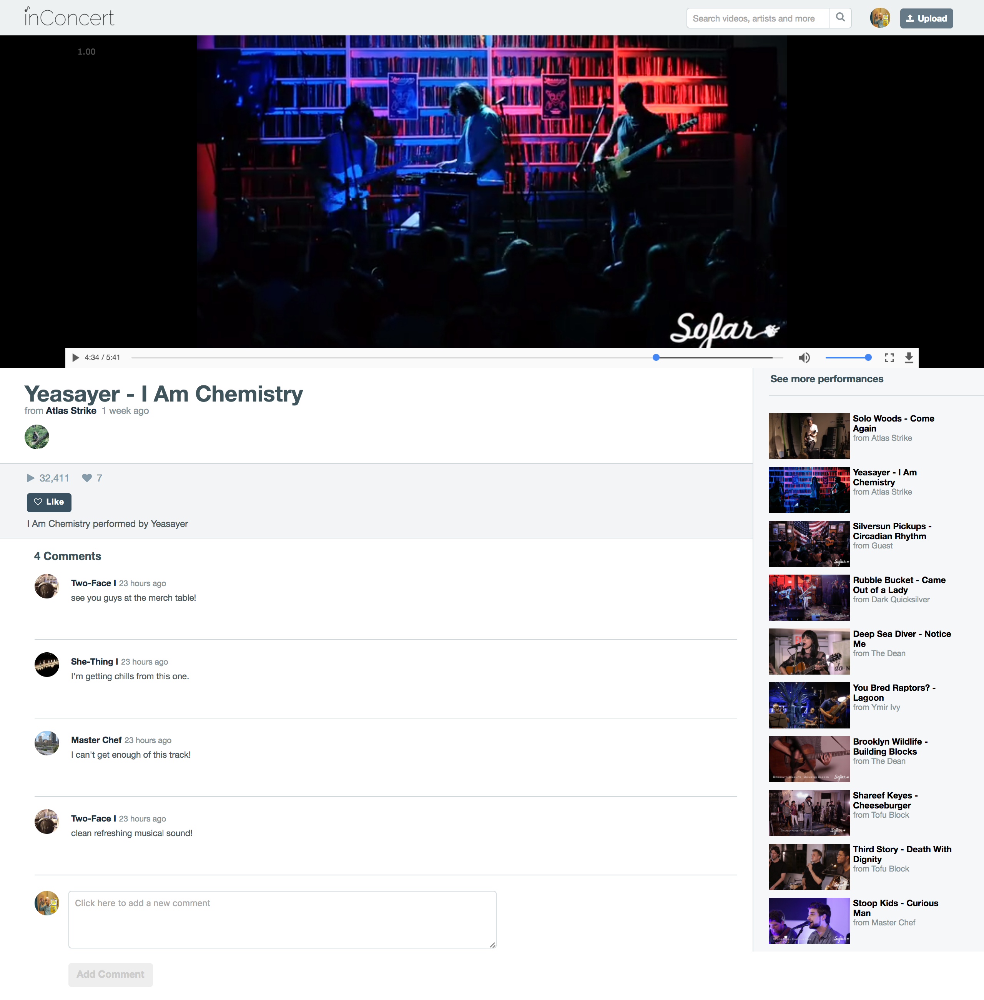
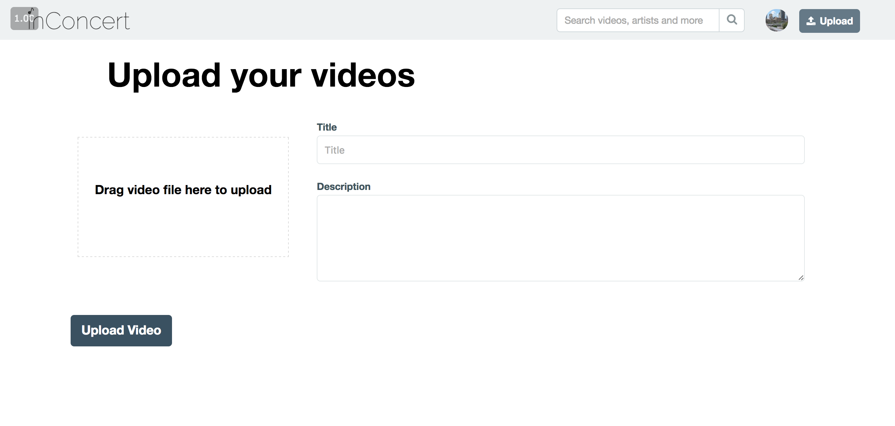
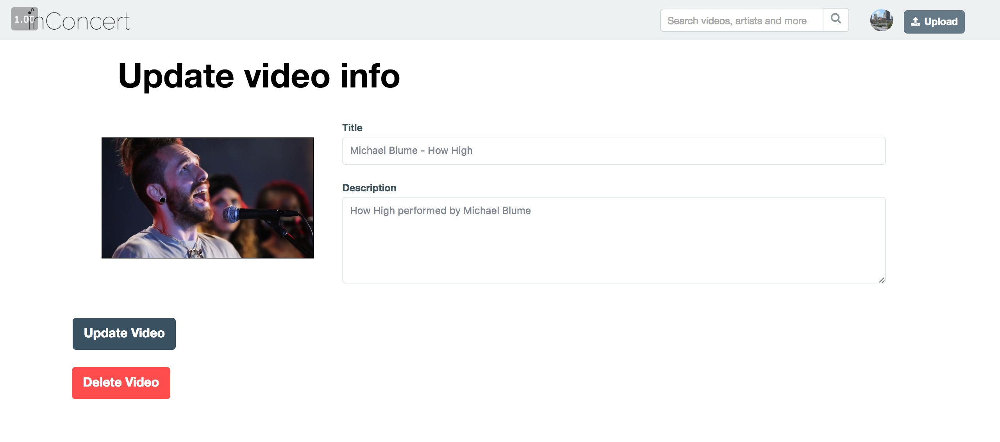
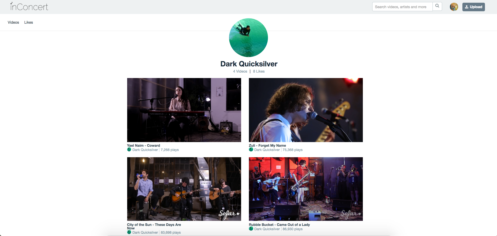
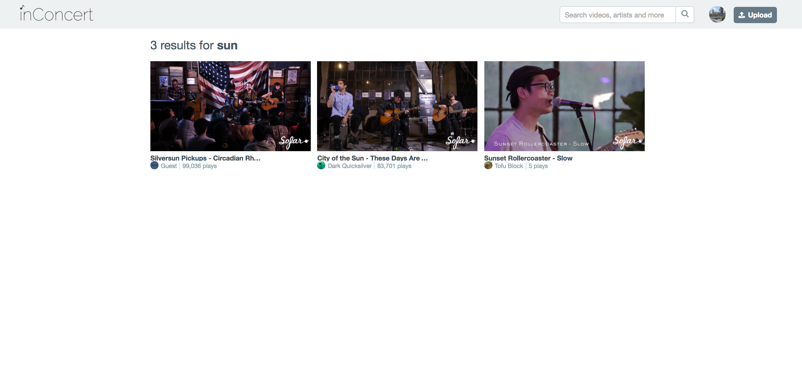

# inConcert

[inConcert Live][heroku]

[heroku]: http://liveinconcert.herokuapp.com

inConcert is a web application inspired by Vimeo, with a musical twist, built using Ruby on Rails and React/Redux. The database is seeded with my favorite videos produced by the live audio/visual team of Sofar Sounds New York where I worked as a videography lead for two years.

## Features and Implementation

### Users

  Users are able to create an account to start uploading videos, writing comments and liking other videos.
A demo account is provided to those who want to test inConcert's features without signing up for a new account. Users are stored in a database table containing their `id`, `username`, `password_digest`, `avatar` and `session_token`. User avatars are stored on AWS and attached to the User model via Paperclip. Users can visit their profile to see an index of videos that they either uploaded or liked by utilizing the `videos` and `liked_videos` database associations written on the User model.

### Videos

  Users can upload, watch, update and delete videos to inConcert. Each video is stored in the database with an `id`, `title`, `description`, `videoitem`, `thumbnail`, `views`, and `user_id`. Videos and thumbnails are attached to model using the paperclip gem and stored on AWS.

  Users can simply upload a video file by dragging and dropping it into the file drop zone created using the `npm` package `react-dropzone`. A successful file drag-and-drop automatically generates a thumbnail so that users do not have to manually upload it themselves. Video thumbnail generation was achieved by loading a blob preview of the video in the background and using Canvas to capture a frame, which is then appended to the upload parameters.

  Users are re-directed to their new video's show page, where other users can like or comment the video and the view count increments by 1 with each visit. Videos are streamed using the `npm` package `ReactPlayer`. Uploaders also have the option to edit their video's title and description or delete the video entirely through the video's edit form.

### Commenting on videos

Users can submit comments to videos and then have the option to edit and delete their comments. Comments are stored in a database table with their `id`, `body`, `video_id`, and `user_id`.

### Liking videos

Users can like a video. The like instance is then stored in the database with an `id`, `user_id` and `video_id`, allowing us to load a user's `liked_videos`. Likes are an easy way for the user to bookmark videos that they enjoy and want to watch again. A like button is only rendered on the video show page when a user is logged in.

### Video Search

Users can search a video by title by using the search bar in the navigation bar. A search API call is made upon submitting the query. Once the query hits the controller, the query parameters are passed into a SQL query that checks for videos with a title or description containing any one of the query strings passed in. Search results are then rendered as video items with their thumbnail, title, views.

## Languages, Frameworks, Libraries

* Ruby on Rails
* PostgreSQL
* React.js
* Redux
* jQuery
* Gems
  * Paperclip
  * Paperclip AV Transcoder
  * Paperclip ffmpeg
  * Amazon Web Services SDK
  * Jbuilder
  * BCrypt
  * Figaro
* NPM packages
  * Nuka Carousel
  * Halogen
  * React Timeago
  * React Player
  * React Dropzone
  * React Masonry

## Screenshots

Home Index:

Video show page:

Video Upload:

Video Update:

User show page:

Search Result page:

Comment Edit form:

Comment Delete:

